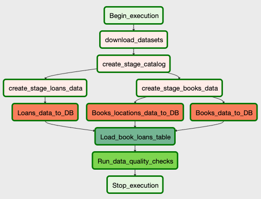
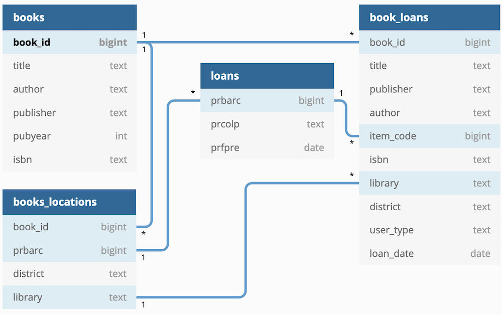
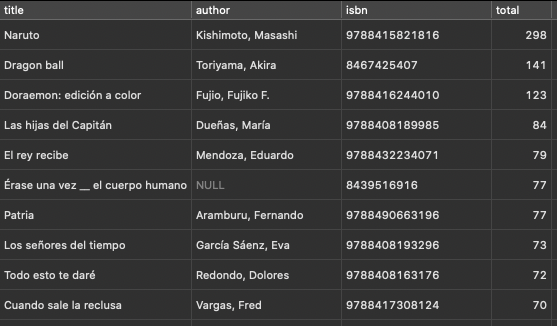

# Capstone

## Scope of Work

The purpose of this project is to demonstrate various skills associated with
data engineering projects. In particular, developing ETL pipelines using
Airflow, data storage as well as defining efficient data models e.g. star
schema, etc. 

For this project I will perform a pipeline using the data of the Madrid Public
Libraries provided by the [Madrid OpenData
Portal](https://datos.madrid.es/portal/site/egob), focusing only on the _book_ 
loans. Just for test purposes the data used will be only for 2018, 
but any other data could be easily added.

## Data Description & Sources

The two main sources used in this project are:

- Library Catalog [(Bibliotecas Públicas de Madrid.
  Catálogo)](https://datos.madrid.es/sites/v/index.jsp?vgnextoid=67065cde99be2410VgnVCM1000000b205a0aRCRD&vgnextchannel=374512b9ace9f310VgnVCM100000171f5a0aRCRD):
wich provides the whole catalog of items stored in all Public Libraries of
Madrid.
- Historical active Loans [(Bibliotecas Públicas de Madrid. Préstamos
  Activos)](https://datos.madrid.es/sites/v/index.jsp?vgnextoid=b98bde41aceeb410VgnVCM2000000c205a0aRCRD&vgnextchannel=374512b9ace9f310VgnVCM100000171f5a0aRCRD):
which provides the historical of all loans from 2014 until the current year. 

## ETL Process

The pipeline is executed using [Airflow](https://airflow.apache.org/), here is
the diagram of the pipeline:



### Download datasets

The first step for the pipeline is to download all the datasets from the
repository, for this I'm using an Airflow PythonOperator and the library
[wget](https://pypi.org/project/wget/). The data is stored in the _datasets_
folder.

### Process staging data

The loans records are stored in CSV format, so this data could be used directly with no
processing.

The catalog dataset is provided in the [MARCXML
format](https://en.wikipedia.org/wiki/MARC_standards#MARCXML), to make use of
the data  this needs to be converted from this format. For this task I'm
using the library [pymarc](https://pypi.org/project/pymarc/), which allow
convert MARC into JSON. As part of the scope of the project only the data for
books will be extracted. To determine how to extract only those items the script
needs to filter the data using some specific MARC fields (as stated in the
documentation provided from the dataset repository), finally only those records
will be stored in a JSON file which will be used for the next step.

### Transform Data

Once the data is downloaded and processed we need to obtain the data to be used
for both fact and dimension tables.

For this process I'm using [pandas](https://pandas.pydata.org) to read the
_catalog_ dataset and the _loans_ dataset. From the catalog we can obtain the
data for the _books_ and their _locations_ on the libraries, each library could
have many items of each books and each of one is identified by an unique code
(_prbarc_). 

In this same step we will get also the data for each loan made in each library, 
as in these data there are all the item loans we need also to filter the
attribute `prcocs` which identify the type of item, in our case this value
should be `LIB`.  

### Load data

In this step we already have all the data needed in CSV files, here we need to
export the data into the database, the first step is to load the fact tables:

```
TABLE books (
    book_id bigint PRIMARY KEY,
    title text,
    author text,
    publisher text,
    pubyear integer,
    isbn text
)

```

```
TABLE loans (
    prbarc bigint,
    prcolp text,
    prfpre date
)
```

```
TABLE books_locations (
    book_id bigint,
    district text,
    library text,
    prbarc bigint
)
```
After the data is loaded in these tables, we are ready to obtain the data from
them and store it into the dimensional table:

```
TABLE book_loans (
    book_id bigint,
    title text,
    publisher text,
    author text,
    item_code bigint,
    isbn text,
    library text,
    district text,
    user_type text,
    loan_date date
)
```

Here is a ERD diagram of the database structure:



The database used in this project is [Postgres](https://www.postgresql.org), but it should work also with
[Redshift](https://aws.amazon.com/redshift/)

## Instructions

- Install required libraries:

First you need to execute the following commands:

```
pip install -r requirements.txt
```

- Create tables:
```
psql -U $DB_USER -h $DB_HOST -W $DB  < create_tables.sql
```

- Configure a Postgres connection in Airflow, the default conection name used in this
  project is `capstone_db`.

- Start the Airflow scheduler and webserver and open the Admin page to trigger
  the DAG.

## Future work

As I mentioned at first this project only covers the loans of books for the year
2018, this could be extended to use all the other types of items and also
incorporate data from other years, currently the Open Data Portal of Madrid
offers data from 2014 until the curren date.

Incorporate more data related to the book using the ISBN field, with that we can
obtain more info like price, reviews, etc. which could be useful to add more
value to the data processed.

Add a visualisation tool to generate reports, graphs, etc. That way obtain
insights of the data could be easy. Here is the Top 10 books on loan in 2018:

 
